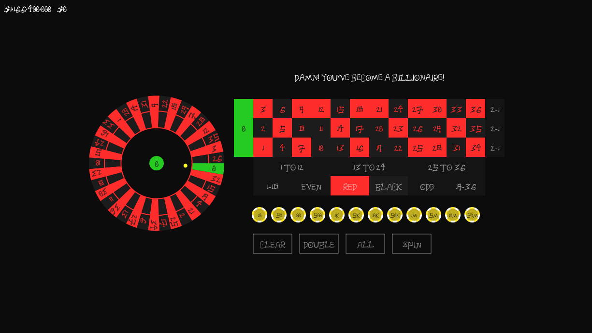

# Rūretto dev

**Rūretto** is an interactive casino game that allows players to place bets on a roulette wheel. This README provides an overview of the game's functionality, including the input handling mechanism and user data management.


## Introduction

This project is a simple yet engaging simulation of the roulette game, developed as a showcase of the capabilities of the Tender language.

## Preview



## Installation

To run this game, you will need to have the Tender interpreter installed on your machine. Follow the instructions below to get started:

1. **Install Go**: Ensure you have the latest version of Go installed on your machine. You can download it from [golang.org](https://golang.org/dl/).

2. **Install Tender**: Use the following command to install Tender:
   ```bash
   go install github.com/2dprototype/tender/cmd/tender@latest
   ```

   Alternatively, you can download precompiled binaries from the [Tender Releases](https://github.com/2dprototype/tender/releases) page. Choose the appropriate binary for your operating system and follow the installation instructions provided there.

3. **Clone the Repository**:
    ```sh
    git clone https://github.com/IHEfty/Ruretto-dev.git
    cd Ruretto-dev
    ```

2. Install [Tender](https://github.com/2dprototype/tender) on your machine.

3. Run the roulette game:
    ```sh
    tender main.td
    ```

## Table of Contents

- [Features](#features)
- [Input Handling Function](#input-handling-function)
- [User Data Management](#user-data-management)
- [Installation](#installation)
- [Usage](#usage)
- [License](#license)

## Features

- Real-time number input for placing bets.
- Automatic reset of input after a short period of inactivity.
- Persistent user data storage for maintaining player settings and statistics.

## Input Handling Function

### Code Overview

```tender
var chars = "1234567890"
var n = ""

export fn(e, cm) {
    // Capture number input and reset after 2 seconds
    if includes(chars, e.rune) {
        n += string(e.rune) 
        go(fn(){
            times.sleep(times.second*2)
            n = ""
        })
    }
    // Handle input confirmation for placing bets
    else if e.code == 40 {
        a := int(n)
        if is_int(a) {
            if a >= 0 && a <= 36 {
                for i, w in wheel {
                    if a == w.number {
                        cm.i = i
                    }
                }
            }
            n = ""
        }
    }
    // Reset on invalid input
    else {
        n = ""
    }
}
```

### How It Works

1. **Variable Initialization**:
   - `var chars = "1234567890"`: Contains valid characters for player input (numbers 0-9).
   - `var n = ""`: Temporary storage for the player's input.

2. **Input Capture**:
   - The `export fn(e, cm)` function handles keyboard events.
   - `if includes(chars, e.rune)`: Checks for valid number input, appending valid characters to `n`.
   - **Automatic Reset**: A goroutine resets `n` after 2 seconds of inactivity to keep the input system responsive.

3. **Bet Confirmation**:
   - `else if e.code == 40`: Checks for the Enter key, indicating a bet placement.
   - Converts `n` to an integer (`a := int(n)`) and validates it (0-36).
   - If valid, updates `cm.i` to process the bet on the selected number, and resets `n`.

4. **Invalid Input Handling**:
   - Resets `n` to an empty string if the input is invalid.

### Why This is Needed
- **User Interaction**: Essential for real-time betting in the game.
- **Clear Feedback Loop**: Keeps the interface clean and prevents outdated input.
- **Robustness**: Validates input to enhance user experience and prevent crashes.

## User Data Management

### Code Overview

```tender
import "fs"
import "os"
import "path"

var user_dir = path.join(os.getenv("appdata"), "Rūretto")
var user_file = path.join(user_dir, "userdata.dat")

if !fs.exists(user_dir) {
    fs.mkdir(user_dir)
}

fs.writefile(user_file, `{"betting_scale":1,"betting_chips":[],"points":1}`)
```

### How It Works

1. **Directory and File Setup**:
   - Constructs a path for a user-specific directory named "Rūretto" within the application data folder.
   - Defines the path for the user data file (`userdata.dat`).

2. **Directory Creation**:
   - Checks for the existence of `user_dir` and creates it if it doesn't exist.

3. **Data Initialization**:
   - Writes an initial JSON structure to `userdata.dat`, which includes:
     - `betting_scale`: Default set to 1.
     - `betting_chips`: An empty array for storing chips.
     - `points`: Initial points set to 1.

### Why This is Needed
- **Persistent User Data**: Maintains player progress across sessions, enhancing engagement.
- **Customization**: Allows players to return with their previous settings intact.
- **Modularity and Organization**: Keeps user data organized and easily accessible.

## Installation

To install **Rūretto**, clone the repository and run the Tender interpreter with the provided scripts.

```bash
git clone https://github.com/IHEfty/Ruretto-dev
cd Ruretto-dev
tender main.td
```

## Usage

1. Launch the game using the Tender interpreter.
2. Input your bets using the number keys.
3. Press Enter to confirm your bet.
4. Your progress and settings will be saved automatically.

## License

This project is licensed under the MIT License - see the [LICENSE](LICENSE) file for details.
